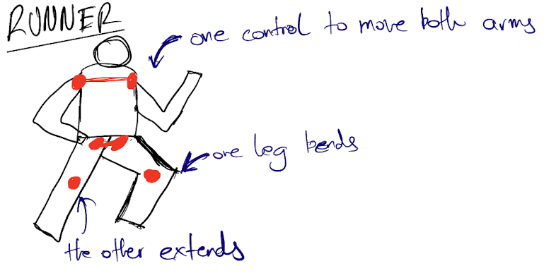
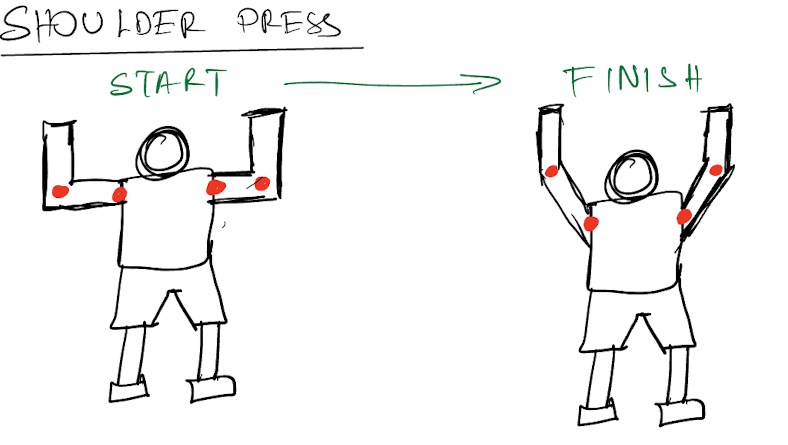
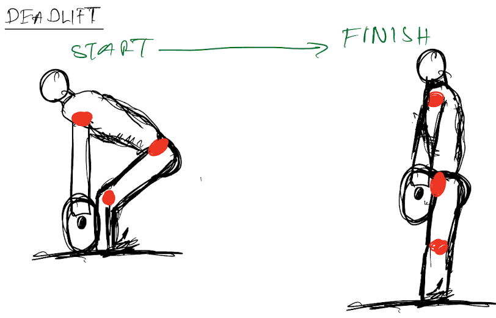

# The Playground

My idea for the clock revolves around my time spent in the gym. I want to make this piece as mechanically accurate as possible with various exercise movements.

I break down the different activity levels below.
I have also drawn a rough draft of my playground.

# Quarter hour activity

There is a person warming up on the track by jogging.
Legs and arms swing and track rotates below to provide an illusion of motion.

Legs swing via a slotted link mechanism to provide back and forth movement.
Arms swing via a cam and crank mechanism to provide swinging motion.
A DC motor could be used for the central movement of the runner.

[Video for reference](https://www.youtube.com/watch?v=87ge3mrLboo&ab_channel=OliverPett-MechanicalCreations)

Audio of footsteps on track via speaker.
LED light underneath the track showing gradient of colors as it rotates, adding to the illusion.

# Half hour activity

Person doing seated dumbbell, shoulder press.
Hands holding dumbbells, moves up and down.

I'm thinking of a mechanism similar to the one shown in the desert flower where the petals close by a string drawn.
The string would be attached to servo motor that moves up and down to pull the string.

Audio of woosh sound as dumbells go up and down.
Green to red LED light change as dumbbell goes from bottom to top position.

# Full hour activity

Person doing a deadlift.
Person bent over barbell, pushes up from ground, hinges at hips to lift up barbell. Hinges back down, and squats back down.

I am not sure about how to go about this yet. One idea was have a rod that pushes the butt up and to the left to mimic the push and hinging motion.
The arms would swing freely but gravity would hold it close to the body as the person rises.

Possibly another slotted link mechanism driven by a DC motor

Audio of banging weights when barbell reaches the bottom.
Platform turns from white to red as weight is lifted off the ground.

