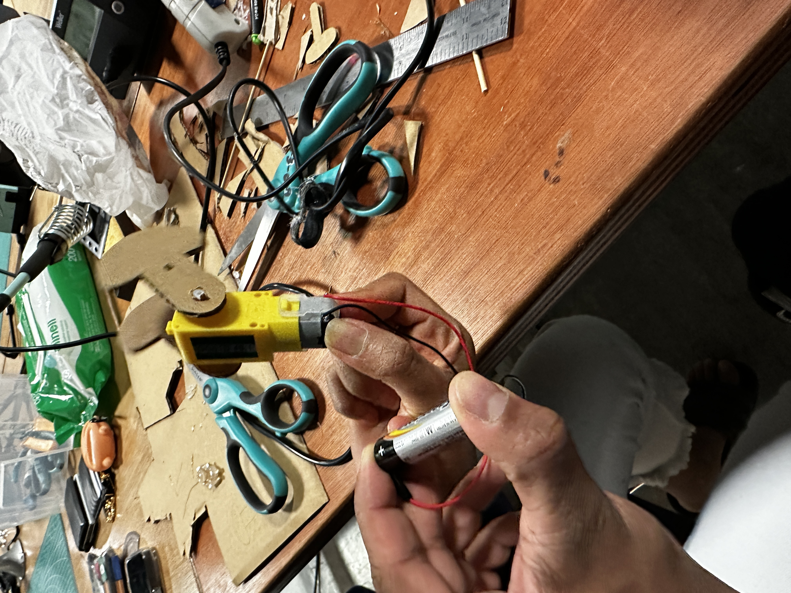

# Prototype for Oil Rig

This prototype was pretty straightforward to make. I simply followed the shapes I saw online along with a few reference videos listed below:

1. [Oil rig mechanism](https://www.youtube.com/watch?v=X0Dpd52pfp0)
2. [Amazon wooden model](https://www.google.com/search?q=oil+rig+wooden&sa=X&biw=1920&bih=1001&tbm=shop&sxsrf=APwXEdeQc2o_7uEFj8xvjQT0zkmWq-hp2w%3A1680024710720&ei=hiQjZNeqK82RkdUP7ZylqAg&ved=0ahUKEwjXheLgk__9AhXNSKQEHW1OCYUQ4dUDCAg&uact=5&oq=oil+rig+wooden&gs_lcp=Cgtwcm9kdWN0cy1jYxADMggIABAWEB4QGDoFCAAQgAQ6BwgAEIAEEBg6BggAEBYQHjoKCAAQFhAeEA8QGDoKCAAQCBAeEA0QGEoECEEYAVC8B1jHDGDDEGgCcAB4AIABgQKIAfMKkgEDMi02mAEAoAEBwAEB&sclient=products-cc#spd=3140402717021178283)

# Images and videos

[VID1](https://youtube.com/shorts/dH-2xO-vWU0?feature=share)
[VID2](https://youtube.com/shorts/a7urIKaFe8E?feature=share)
[VID3](https://youtube.com/shorts/siwFZLb3WLg?feature=share)
