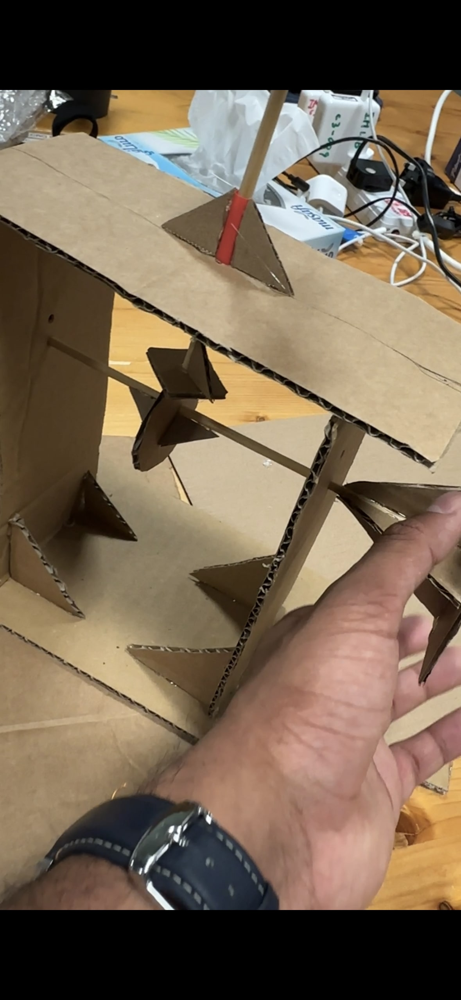
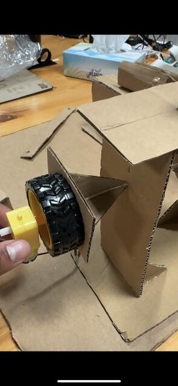
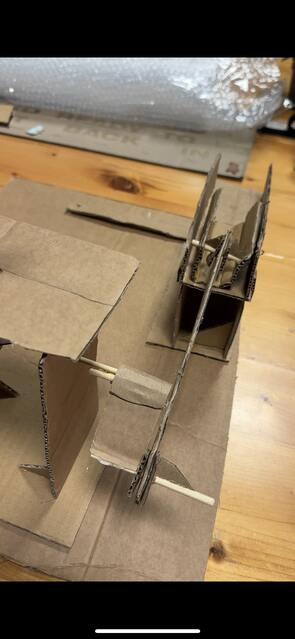

# Building a cam along with a crank and slider mechanism

It was really interesting to work on this first machine lab project.
The readings in the book especially helped with understanding the mechanisms of the cam, crank and slider.

I did most of the calculations for length and width intuitively or by trial and error but luckily I didn't run into many issues.

## Problems faced

1. The skewer I initially used to rotate the cam was too short, so I had to take it apart and replace it with a longer skewer in order to attached the motor wheel.
2. The bottom of the cam follower was initially using a small square platform but this was getting jammed. I replaced it with a larger, rounder bottom and this seemed to work fine.

## Progress pictures

## Short video

