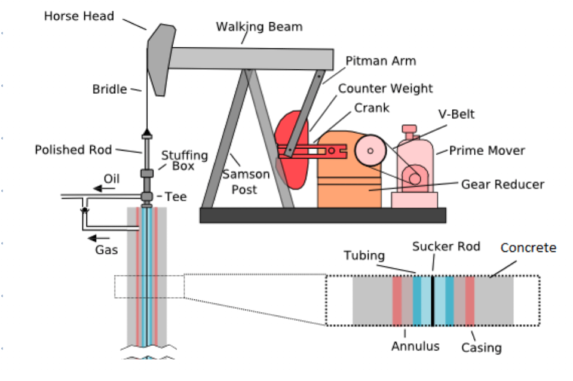
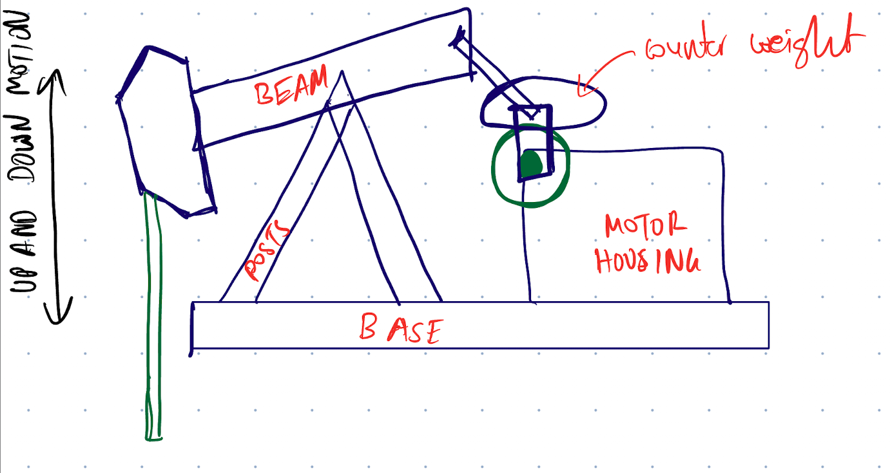
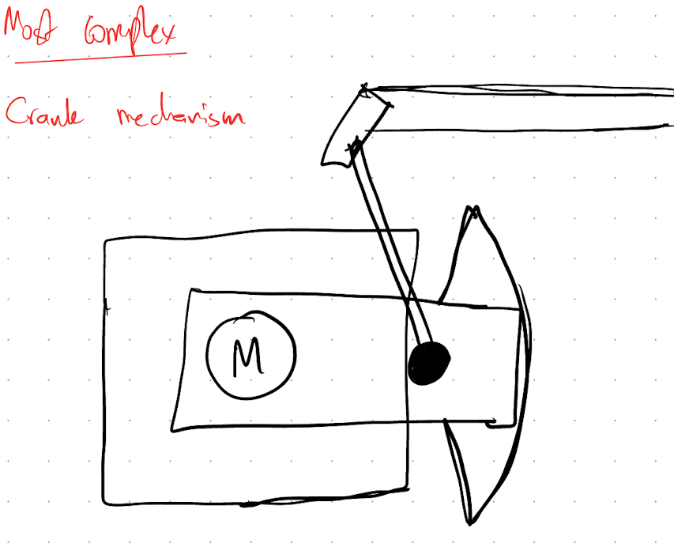

# Oil Rig

This machine is inspired by the oil rigs that are present in the UAE due to its abundance in oil.

# Mechanism overview

I will be constructing the main part of this structure which is the horse head mechanism that moves it up and down.

# Parts needed

The main part needed will be the motor driving the crank to enable the rotation of the crank which allows the hammer head to go up and down. I plan on using a DC motor for this.

I will prototype it using cardboard to ensure that the mechanism works and properly design it using metal parts to give it an industrial feel.

For audio effects, I plan on adding a soundtrack of oil rigs working (mostly just metal parts moving, imagine a train)

# Difficult mechanism

This would be the hardest part to build since I would need to get all the measurements right and the counter weight exact in order to make sure there is smooth movement.

I plan on researching more on the mechanics of oil rigs in order to make a holistic project.

# Reference

[Oil Rigs](https://www.youtube.com/watch?v=X0Dpd52pfp0)